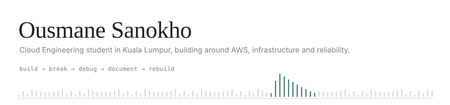

<picture>
  <source media="(prefers-color-scheme: dark)" srcset="pipeline-dark.svg">
  
</picture>

## Ousmane Sanokho

Second-year BSc (Hons) Information Technology, Cloud Engineering — Asia Pacific University, Kuala Lumpur.

**I break my own infrastructure on purpose, then work out how to get it back.**

Most of what I actually understand about cloud engineering, I learned in the gap between "it deployed" and "it's working." So I build small systems end to end, then take something away — an IAM permission, a security group rule, the entire environment — and read what the logs say. The three projects below are in the order I built them. Each one exists because the previous one left me with a question I couldn't answer.

---

### [ai-internship-copilot](https://github.com/OusmaneSanokho/ai-internship-copilot) — build it

A CV analyser for students applying to internships. Upload a PDF, optionally paste a job description, get back a structured report instead of a wall of chat text. Server-side validation, PDF magic-byte checks, and prompt-injection sanitisation, because the input is a file a stranger uploaded. [Live on Vercel](https://ai-internship-copilot-rho.vercel.app).

Taught me that shipping is the easy part, and that everything interesting starts after the first deploy.

`Next.js` `TypeScript` `Claude API` `Supabase / Postgres` `Vercel`

### [cloudrescue](https://github.com/OusmaneSanokho/cloudrescue) — operate it

A monitoring and bounded-recovery system, written from scratch rather than assembled from Prometheus and Grafana, specifically so I'd have to make the design decisions myself. It polls a health endpoint, distinguishes healthy from degraded from down, alerts once per incident instead of once per failure, and restarts a crashed service — but only three times, then it stops and says a human is needed.

Taught me that detecting failure is straightforward and alerting on it well is not. Consecutive-failure counting misses flaky services entirely; that's why there's a rolling time window too.

`Python` `Flask` `Docker Compose` `SQLite` `GitHub Actions` `AWS EC2` `Linux`

### [deployguard](https://github.com/OusmaneSanokho/deployguard) — get it there safely

The infrastructure and delivery system around an application, rather than the application itself. 44 AWS resources, all in Terraform: a VPC with private subnets that have no internet route at all, ECS Fargate behind an ALB, RDS Postgres reachable only through a security group chain, and a GitHub Actions pipeline that authenticates through OIDC so there are no AWS keys stored anywhere. A bad deploy rolls itself back.

Taught me how the pieces fit: that least privilege is a networking decision as much as an IAM one, and that a deploy pipeline is mostly a machine for catching your own mistakes.

`Terraform` `AWS` `ECS Fargate` `ALB` `RDS` `VPC endpoints` `IAM` `SSM Parameter Store` `CloudWatch` `GitHub OIDC` `FastAPI` `Docker`

<b>Things I broke on purpose, and what happened</b>

 

**Took away the ECS execution role's permission to read the database password from SSM.** New tasks refused to start with an explicit access-denied error naming the exact resource. The already-running task carried on serving traffic, because it had resolved its secret before I removed the permission.

**Put the permission back and redeployed immediately.** Two more deploys still failed before one succeeded. IAM is eventually consistent, and I only learned that by being impatient.

**Ran `terraform destroy` against all 44 resources, then rebuilt them from the same code.** Everything came back with new identifiers — new load balancer address, new database instance. The app was serving again once the pipeline ran.

**Killed CloudRescue's monitor process from inside its own container.** Docker's restart policy brought it back. Then I killed the container from outside and nothing happened, because Docker treats an external kill as intentional. Two different failure modes that look identical in a diagram.

**Watched CloudRescue log a successful recovery that hadn't happened.** Its restart call spawns a new process inside the monitor's own container instead of restarting the app container. The logs said recovered; the outage was still there. That one is documented in the repo as an open limitation, not fixed.

---

### Working with

| | |
|---|---|
| **Cloud** | AWS — VPC, ECS / Fargate, ECR, ALB, RDS, IAM, SSM Parameter Store, CloudWatch, SNS, EC2 |
| **Infrastructure as code** | Terraform |
| **Delivery** | GitHub Actions, GitHub OIDC, Docker, Docker Compose |
| **Languages** | Python, TypeScript, SQL, Bash |
| **Application** | FastAPI, Flask, Next.js, React |
| **Data** | PostgreSQL, SQLite |
| **Systems** | Linux, Git |

### Currently

- Studying for the **AWS Solutions Architect – Associate (SAA-C03)**. Not taken yet.
- Splitting DeployGuard's single `main.tf` into proper Terraform modules, with real variables and outputs.
- Adding a smoke test to the deploy pipeline, so a broken health check gets caught before it reaches the live environment instead of after.
- Working out what Prometheus and CloudWatch give you that my hand-rolled monitoring doesn't, now that I've written the hand-rolled version.

Looking for a 4–6 month Cloud / DevOps / SRE internship starting January 2027.

---

[LinkedIn](https://www.linkedin.com/in/ousmane-sanokho-8b05703a7) · Kuala Lumpur, Malaysia
